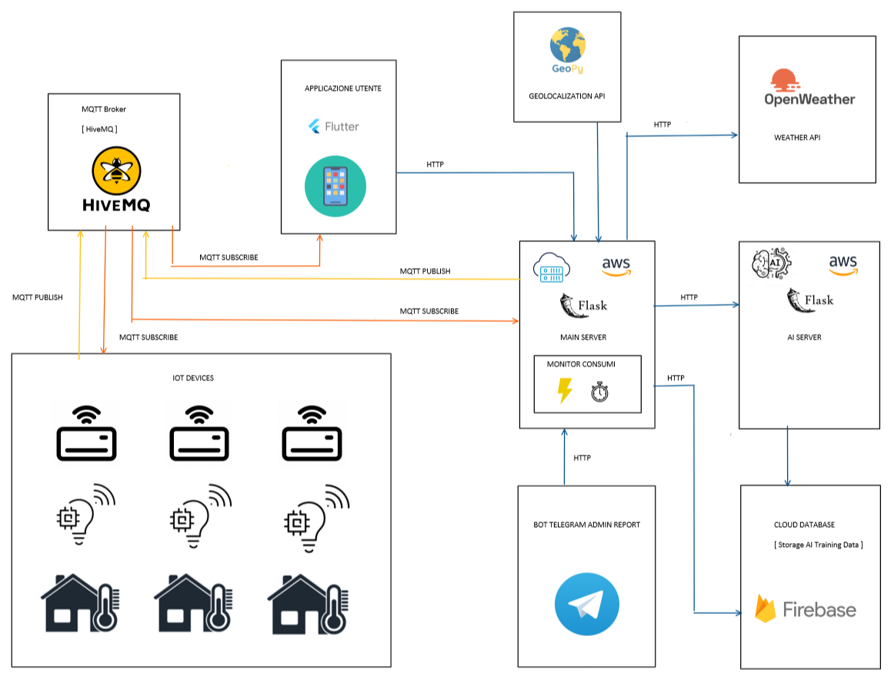

<!-- PROJECT LOGO -->
 

  

  <h3 align="center">Smart Office - Project Built for IoT and 3D Intelligent Systems University Exam</h3>

<!-- ABOUT THE PROJECT -->
## About The Project

 
Main Contributors:

* Felicia
  - Building electronic prototipe, cabling, wiring, Arduino C code and MQTT protocol API both on MCU, python server-side and mobile application, Flutter app developement, CSS styling of the web app, telegram API connection, power consumption algorithm
* Bilel (BillyArfaoui ex account now NakajimaAkemi)
  - Back-end Flask developement, SQL database building, management and queries, Firebase database connection and management, web application, AWS EC2 containers management, Openweather and geolocalization APIs, power consumption algorithm
* Vince
  - Data preprocessing, machine learning algorithms

### System Design

  
 

 

### Built With

* [![Python][python-badge]][python-url]
* [![Flutter][flutter-badge]][flutter-url]
* [![AWS][aws-badge]][aws-url]
* [![Arduino][arduino-badge]][arduino-url]
* [![HiveMQ][hivemq-badge]][hivemq-url]
* [![Flask][flask-badge]][flask-url]
* [![HTML5][html-badge]][html-url]
* [![CSS][css-badge]][css-url]
* [![Firebase][firebase-badge]][firebase-url]
* [![Telegram API][telegram-badge]][telegram-url]
* [![SQL Alchemy][sqlalchemy-badge]][sqlalchemy-url]

<!-- MARKDOWN LINKS & IMAGES -->
<!-- https://www.markdownguide.org/basic-syntax/#reference-style-links -->
[contributors-shield]: https://img.shields.io/github/contributors/othneildrew/Best-README-Template.svg?style=for-the-badge
[contributors-url]: https://github.com/othneildrew/Best-README-Template/graphs/contributors
[forks-shield]: https://img.shields.io/github/forks/othneildrew/Best-README-Template.svg?style=for-the-badge
[forks-url]: https://github.com/othneildrew/Best-README-Template/network/members
[stars-shield]: https://img.shields.io/github/stars/othneildrew/Best-README-Template.svg?style=for-the-badge
[stars-url]: https://github.com/othneildrew/Best-README-Template/stargazers
[issues-shield]: https://img.shields.io/github/issues/othneildrew/Best-README-Template.svg?style=for-the-badge
[issues-url]: https://github.com/othneildrew/Best-README-Template/issues
[license-shield]: https://img.shields.io/github/license/othneildrew/Best-README-Template.svg?style=for-the-badge
[license-url]: https://github.com/othneildrew/Best-README-Template/blob/master/LICENSE.txt
[product-screenshot]: images/screenshot.png
[flutter-badge]: https://img.shields.io/badge/Flutter-badge?style=for-the-badge&logo=flutter&labelColor=%2302569B&color=%2302569B
[flutter-url]: https://flutter.dev/
[flask-badge]: https://img.shields.io/badge/Flask-badge?style=for-the-badge&logo=flask&labelColor=%23000000&color=%23000000&logoColor=%23FAFAFA
[flask-url]: https://flask.palletsprojects.com/en/3.0.x/
[aws-badge]: https://img.shields.io/badge/AWS-badge?style=for-the-badge&logo=amazonec2&labelColor=%23FF9900&color=%23FF9900&logoColor=%23FAFAFA
[aws-url]: https://www.aboutamazon.eu/
[python-badge]: https://img.shields.io/badge/Python-badge?style=for-the-badge&logo=python&labelColor=%233776AB&color=%233776AB&logoColor=%23FAFAFA
[python-url]: https://www.python.org/
[hivemq-badge]: https://img.shields.io/badge/HiveMQ-badge?style=for-the-badge&logo=hivemq&labelColor=%23FFC000&color=%23FFC000&logoColor=%23FAFAFA
[hivemq-url]: https://www.hivemq.com/
[firebase-badge]: https://img.shields.io/badge/firebase-badge?style=for-the-badge&logo=firebase&labelColor=%23FFCA28&color=%23FFCA28&logoColor=%23FAFAFA
[firebase-url]: https://firebase.google.com
[arduino-badge]: https://img.shields.io/badge/arduino-badge?style=for-the-badge&logo=arduino&labelColor=%2300878F&color=%2300878F&logoColor=%23FAFAFA
[arduino-url]: https://www.arduino.cc
[html-badge]: https://img.shields.io/badge/html-badge?style=for-the-badge&logo=html5&labelColor=%23E34F26&color=%23E34F26&logoColor=%23FAFAFA
[html-url]: https://en.wikipedia.org/wiki/HTML
[css-badge]: https://img.shields.io/badge/css-badge?style=for-the-badge&logo=css3&labelColor=%231572B6&color=%231572B6&logoColor=%23FAFAFA
[css-url]: https://it.wikipedia.org/wiki/CSS
[telegram-badge]: https://img.shields.io/badge/telegram-badge?style=for-the-badge&logo=telegram&logoColor=%23FAFAFA&labelColor=%2326A5E4&color=%2326A5E4
[telegram-url]: https://core.telegram.org/
[sqlalchemy-badge]: https://img.shields.io/badge/telegram-badge?style=for-the-badge&logo=telegram&logoColor=%23FAFAFA&labelColor=%2326A5E4&color=%2326A5E4
[sqlalchemy-url]: https://www.sqlalchemy.org/
